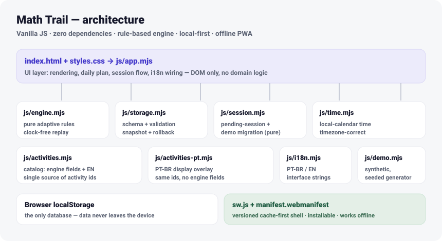

# Math Trail 🦕

**A calm, adaptive early-math planner for the parent of a toddler — the child never touches the screen.**
Vanilla JavaScript, zero runtime dependencies, offline-first. One small, local-first app that plans, guides and records five-minute off-screen math moments at home.

[](https://github.com/samuel3ssilva/math-trail/actions/workflows/ci.yml)
[](LICENSE)

**[▶ Live demo (synthetic data)](https://samuel3ssilva.github.io/math-trail/?demo=1)** · **[Empty app](https://samuel3ssilva.github.io/math-trail/)** · **[Latest release](https://github.com/samuel3ssilva/math-trail/releases/latest)** · **[Case study](docs/case-study.md)** · **[Usage guide](docs/usage-guide.md)** · **[Tech docs](docs/architecture.md)** · [Leia em português](README.pt-BR.md)



**Interactive screens:** the [live synthetic demo](https://samuel3ssilva.github.io/math-trail/?demo=1) is the always-current screenshot — open it on a phone or desktop.

---

## The problem

Most "educational apps" solve early math by putting a screen in front of the child. For a 2.5-year-old that is the opposite of what the research and the pedagogy (Kate Snow's *Preschool Math at Home*) ask for: short, playful, hands-on moments with real objects — snap cubes, toy dinosaurs, dice, paper and pen.

The hard part isn't the math. It's that a busy parent, in the moment, doesn't know *what to do right now*, *how to run it*, or *whether any of it is adding up*. Math Trail is the tool that answers those three questions — for the **adult**.

## Who uses it, and the main flow

The **parent** is the only user. The child plays off-screen with real materials.

1. **Plan** — three optional daily windows (morning / afternoon / bedtime). Pick an activity or tap ✦ for a suggestion; the app shows a setup diagram, a parent script and *why* it was suggested.
2. **Do it** — start a timed session, run the activity with the child, then end it.
3. **Log** — three quick choices (how it went, the child's mood, how the challenge felt), plus an optional note. A finished session is held safely until you save it.
4. **Reflect** — a history thread by day and a Progress tab: a skill trail, milestones being built, mood over time — as plain counts, never grades.

### Why the child stays off-screen

This is the central product decision, not an omission. Screen time is the thing this app *replaces*. Everything in the UI addresses the adult: scripts, non-evaluative logging language, mood tracked as an observation rather than a score. The child's experience is cubes and dinosaurs on a kitchen table.

## Technical highlights

- **Zero dependencies, no framework** — runtime *and* build. Even the linter is dependency-free ([ADR-0003](docs/adr/0003-no-tooling-deps.md)). The app deploys as static files and is meant to outlive framework churn.
- **Deterministic, explainable engine** — pure rules with an injected clock and RNG; `replayState(logs)` is clock-free and temporal rules are evaluated at read time ([ADR-0002](docs/adr/0002-clock-injection.md)). Honestly documented as a **rule-based system, not machine learning** ([docs/model-card.md](docs/model-card.md)).
- **Data safety as a feature** — schema-versioned backups, allowlist-validated imports with automatic snapshot + rollback, and a "verbatim-copy-or-nothing" migration policy — born from a real near-miss ([case study](docs/case-study.md)).
- **Child privacy first** — no accounts, no server, no analytics, no third-party calls; data lives only in the device's localStorage. The public repo ships only synthetic data.
- **Offline-first PWA** — a versioned service-worker shell; installs to the home screen and runs with the network off.
- **Full PT-BR / EN** — interface *and* the entire 28-activity catalog.
- **153 automated tests, 0 skipped**, run behind a gated CI pipeline.

## Architecture

A monolithic, modular vanilla-JS app. No bundler; ES modules loaded directly, with a build step that also emits a single-file bundle.

```
index.html ──┬── js/app.mjs         UI layer: rendering, plan, session flow, i18n wiring
             ├── js/engine.mjs      pure adaptive rules (level, mastery, story mode, cooldown…)
             ├── js/activities.mjs  catalog: engine fields + EN display  (single source of ids)
             ├── js/activities-pt.mjs  PT-BR display overlay (same ids)
             ├── js/storage.mjs     persistence, schema version, validation, snapshot + rollback
             ├── js/session.mjs     pure pending-session + demo-migration decisions
             ├── js/time.mjs        local-calendar time (localDateKey), timezone-correct
             ├── js/i18n.mjs        interface strings (PT-BR / EN)
             └── js/demo.mjs        synthetic, seeded demo-data generator
sw.js  ·  manifest.webmanifest      PWA shell + install
```

Separation of concerns is strict: the engine is pure and clock-free, storage owns all persistence contracts, and `app.mjs` only wires them to the DOM. Domain state is always a pure function of the log, so editing or deleting a past session replays the whole history.

## The adaptive engine (rule-based, explainable)

The interesting part lives in [`js/engine.mjs`](js/engine.mjs) — pure functions, fully tested:

| Rule | Behavior |
|---|---|
| **Level auto-adjust** | Two consecutive "too easy" sessions → level up (1→3); one "too hard" → level down. |
| **Mastery** | "Too easy" twice at level 3 → activity marked well-explored, weight reduced in suggestions. |
| **Story mode** | 2 resisted sessions within the last 3 → scripts switch to adventure framing for 3 sessions. |
| **Cooldown** | "Too hard" at the floor level on composition activities → that skill rests for 48h. |
| **Unlock gate** | Two-Dice Count-On only enters the pool after Dice Flash is well-explored ([ADR-0001](docs/adr/0001-two-dice-unlock-rule.md)). |
| **Reward observation** | If treats correlate with markedly more resistance than intrinsic play (min. sample enforced), the app gently suggests connection-as-reward. |
| **Deterministic replay** | State is recomputed from the log; a past edit can never leave state and history out of sync. |
| **Stable daily plan** | Suggestions are seeded by the local date, so the plan doesn't reshuffle on reload. |

It is **not** machine learning: no training, no weights learned from data, no inference. Every suggestion is traceable to a rule and shown to the parent. The ML roadmap below is deliberately future work.

## Child privacy

- No accounts, no backend, no analytics, no third-party requests — verified: the deployed app makes **zero external requests**.
- All data is local (localStorage); nothing leaves the device unless the parent exports a backup file themselves.
- The public repository contains **only synthetic data**. An automated privacy guard fails CI if personal identifiers appear in any tracked file *or* in the built `dist/` artifact.
- Git history was scrubbed of earlier sensitive data ([ADR-0004](docs/adr/0004-git-history-cleanup.md)).
- See [privacy.md](docs/privacy.md), [threat-model.md](docs/threat-model.md), [data-inventory.md](docs/data-inventory.md).

## Security & data integrity

- **No stored-content XSS** — the history renderer builds DOM nodes with `textContent` and real listeners; no log field ever reaches `innerHTML` or an attribute. Imports are validated and normalized to an allowlist (extra fields and `__proto__` payloads dropped). Threat model **T3 mitigated** with tests.
- **No silent data loss** — imports snapshot first and roll back on any failure; migration is verbatim-copy-or-nothing.
- **Timezone-correct** — "today" and day-grouping follow the device calendar, with America/Sao_Paulo boundary tests.

## Tests & CI/CD

```bash
npm run lint    # zero-dependency lint + format gate
npm test        # 153 tests: engine, timezone, storage/migration, privacy guard,
                # catalog localization, XSS, pending session, demo migration, build
npm run build   # deployable dist/ + single-file bundle in dist/standalone/
```

CI runs **lint → tests → build → artifact checks (PWA files, no personal data in `dist/`) → deploy**. GitHub Pages publishes only the built `dist/` artifact, never the repo root. `main` is protected: PRs required, the `quality` status check must pass (strict), no force-push. Deploys are gated on `main`.

## PWA & offline

A cache-first service worker precaches the app shell; the versioned cache name is bumped on every shell change so returning users get updates without clearing anything. Data already lives in localStorage, so the app is fully usable with the network off, and it installs to the home screen.

## AI-assisted engineering

This project was built through **AI-assisted engineering**: models were used in separate roles — implementation, product review and independent audit — while requirements, acceptance criteria, product decisions and merge authorization stayed under **human governance**. One instance implemented; another audited; disagreements were resolved by checking the code, not by trusting a report; findings were not accepted without tests and evidence; CI and branch protection acted as gates; and **no AI had autonomous authority to merge**. The full workflow, including false positives that were withdrawn and fixes that were only accepted once a test proved them, is in [docs/ai-assisted-engineering.md](docs/ai-assisted-engineering.md).

## Run it locally

```bash
git clone https://github.com/samuel3ssilva/math-trail.git
cd math-trail
npm run serve   # http://localhost:8123  (or just open index.html — there is nothing to install)
```

Append `?demo=1` for three weeks of synthetic sample data.

## Repository structure

```
index.html, styles.css, sw.js, manifest.webmanifest   the app
js/                the modules (see Architecture)
tests/             153 tests across 16 files; fixtures/ are synthetic-only
docs/              architecture, model-card, privacy, threat-model, ADRs, case study
docs/assets/       architecture diagram (SVG) used in this README
scripts/           zero-dependency lint + the seeded demo-data generator
demo/generated/    the committed reference demo dataset
```

## Current limitations

- This is **not** a diagnostic or assessment tool, and makes no claim about a child's learning.
- The dataset a single family produces is small; recommendations and the catalog are intentionally simple.
- The engine is rule-based, not ML — no causal conclusions are drawn.
- Professional pedagogical validation is future work.
- Some detail is only verified by hand; see [docs/manual-verification.md](docs/manual-verification.md).

## AI / ML roadmap (future work — not started)

A deliberately conservative, evaluation-first path, kept separate from the shipped rule engine:

`baseline_rule_v1` → synthetic dataset → a lightweight challenger model → champion/challenger evaluation → model card → an explicit decision to integrate or reject the model.

## License

[MIT](LICENSE) — built by [Samuel dos Santos Silva](https://github.com/samuel3ssilva) with AI as a pair-engineer and human judgment as the safety net.
